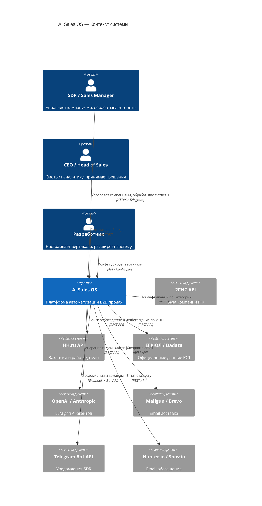
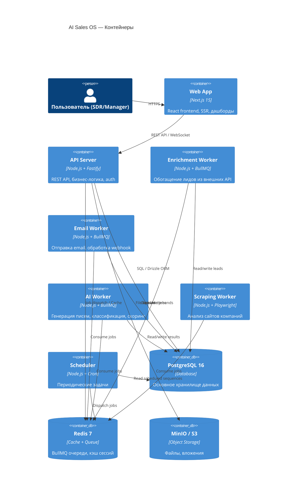
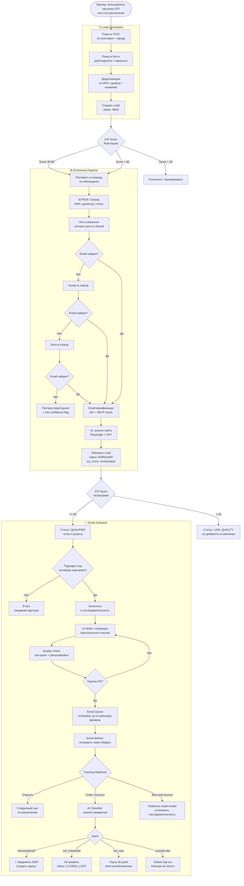
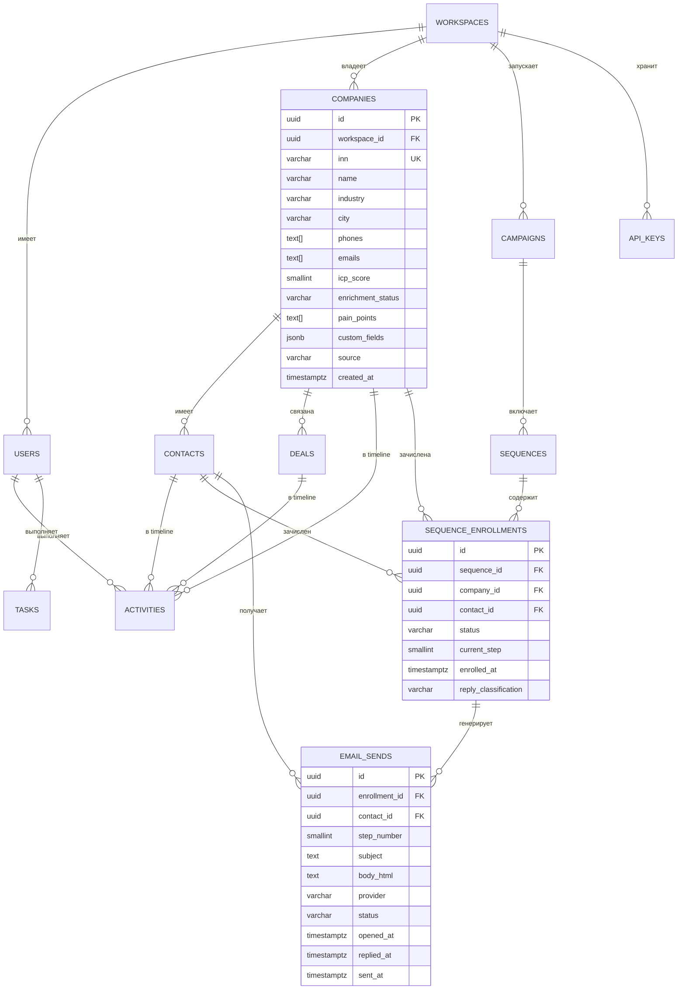
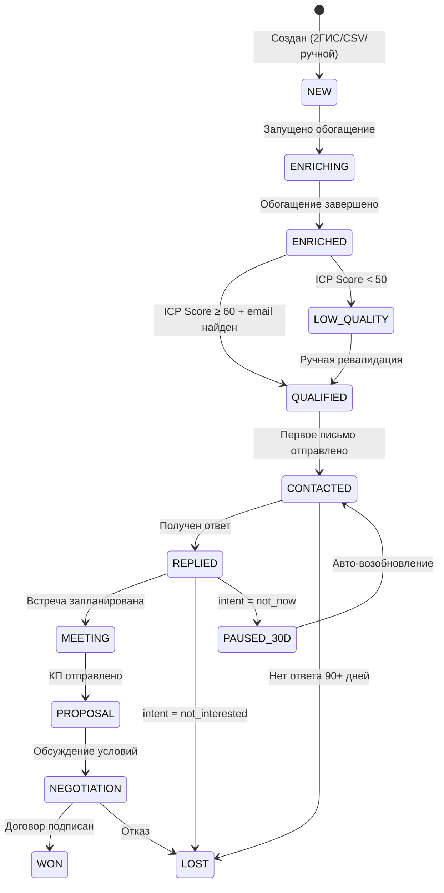
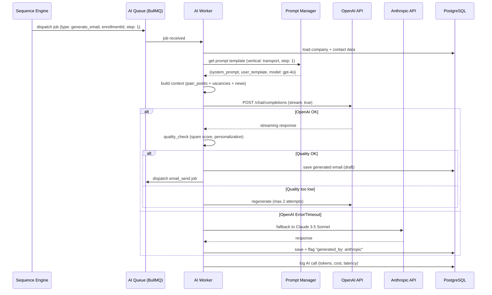
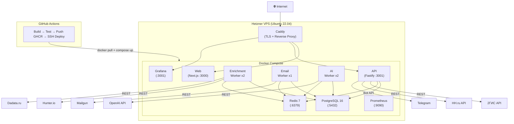

# Architecture Diagrams — AI Sales OS

> Диаграммы в формате Mermaid. Рендеринг: GitHub, GitLab, Notion, или https://mermaid.live

---

## 1. Общая архитектура системы (C4 — Context Level)

---

## 2. Контейнерная диаграмма (C4 — Container Level)

---

## 3. Поток данных: Lead Generation → Enrichment → Outreach

---

## 4. Схема данных (Entity Relationship)

---

## 5. Состояния Lead (State Machine)

---

## 6. AI Worker — внутренняя архитектура

---

## 7. Деплой-диаграмма (Production)

